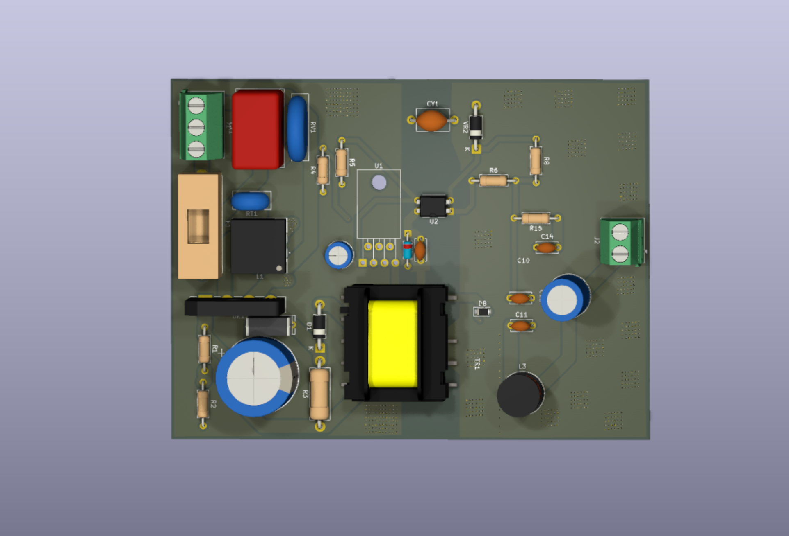
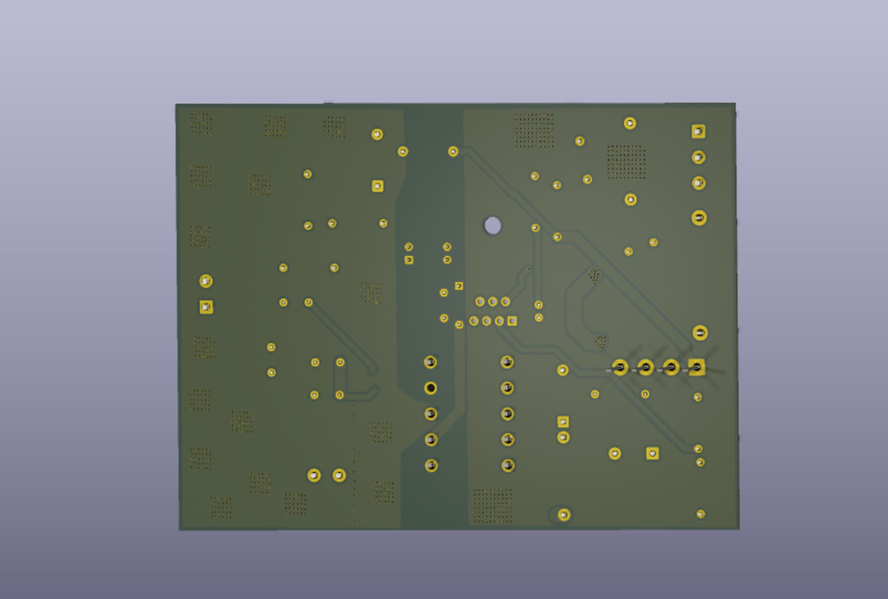
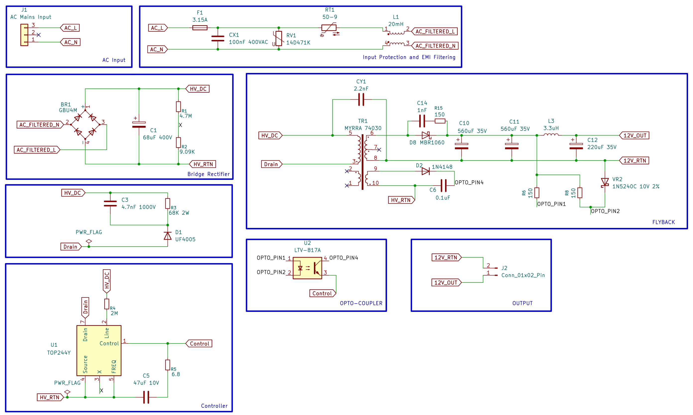

# Universal Isolated SMPS

A **30W isolated AC-DC flyback power supply** designed in **KiCad 9**, capable of converting a universal mains input into regulated isolated DC outputs.

This project implements a complete offline SMPS including EMI filtering, surge protection, isolated feedback, custom transformer footprint creation, PCB layout, 3D visualization, and manufacturing outputs.

---

# PCB Top



---

# PCB Bottom



---

## Specifications

| Parameter | Value |
|-----------|-------|
| Input Voltage | 85–265 VAC |
| Output 1 | 12V @ 2.5A |
| Output 2 | 5V @ 1A |
| Output Power | 30W |
| Isolation | 4 kV |
| Topology | Flyback |
| Controller IC | TOP244Y |
| Transformer | MYRRA 74030 |
| PCB Layers | 2 |

---

# Features

- Universal AC input (85–265 VAC)
- Fully isolated flyback topology
- Reinforced 4 kV isolation
- TOP244Y integrated PWM controller
- Custom MYRRA 74030 transformer footprint & symbol
- EMI input filter
- MOV surge protection
- Fuse protection
- Common-mode choke
- X-Class capacitor
- Y-Class safety capacitor
- Primary RCD snubber network
- Secondary RC snubber
- Schottky output rectification
- Auxiliary transformer winding for controller bias
- Optocoupler-based isolated voltage feedback
- LC output filtering
- High-current PCB routing
- Separate primary and secondary ground planes
- 3D PCB model
- Manufacturing-ready Gerber generation

---

# Functional Overview

### AC Input Stage
- Universal AC input
- Fuse protection
- MOV surge suppressor
- Common-mode choke
- X and Y safety capacitors for EMI suppression

### High Voltage DC Bus
- Full bridge rectifier
- Bulk electrolytic capacitor for DC filtering

### Flyback Converter
- TOP244Y offline switching controller
- MYRRA 74030 flyback transformer
- Auxiliary winding for self-powered operation

### Protection Networks
- Primary RCD snubber to clamp transformer leakage spikes
- Secondary RC snubber to reduce ringing and EMI

### Output Stage
- MBR1060 Schottky rectifier
- LC output filter
- Low ripple 12V output

### Feedback Network
- LTV817A optocoupler
- Zener reference network
- Closed-loop isolated voltage regulation

### Additional Output
- Buck converter generating regulated 5V rail from the 12V output

---

# PCB Design Highlights

- Two-layer PCB
- Custom transformer footprint
- Custom transformer schematic symbol
- Wide power traces for high-current paths
- Dedicated primary HV_RETURN copper pour
- Dedicated secondary return plane
- Isolation barrier between primary and secondary
- Creepage and clearance maintained across isolation boundary
- Optimized placement for reduced switching loop area

---

# Schematic



---

# Repository Structure

```
Hardware/
├── universal_30w_smps.kicad_pro
├── universal_30w_smps.kicad_sch
├── universal_30w_smps.kicad_pcb
└── MYRRA.pretty/

Manufacturing/
├── Gerbers
└── Drill Files

Images/
├── PCB_Front.png
├── PCB_Back.png
└── schematic.png

3D Models/

README.md
```

---

# Design Tools

- KiCad 9
- Custom KiCad Libraries
- Git & GitHub

---

# Future Improvements

- Thermal analysis
- Efficiency characterization
- EMI compliance testing
- Hardware validation
- Oscilloscope waveform measurements
- Short-circuit and overload testing

---

## Author

**Arnav Verma**

Electronics & Computer Engineering

Embedded Systems • PCB Design • Power Electronics • IoT • STM32 • ESP32
